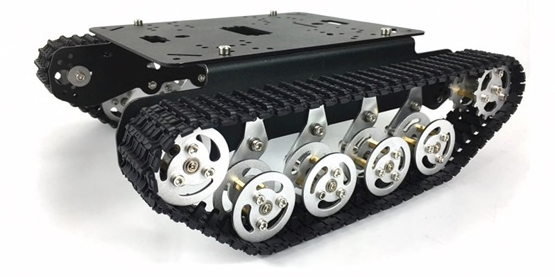
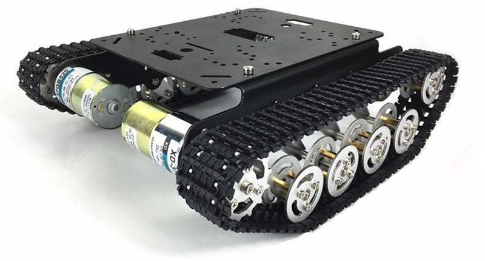
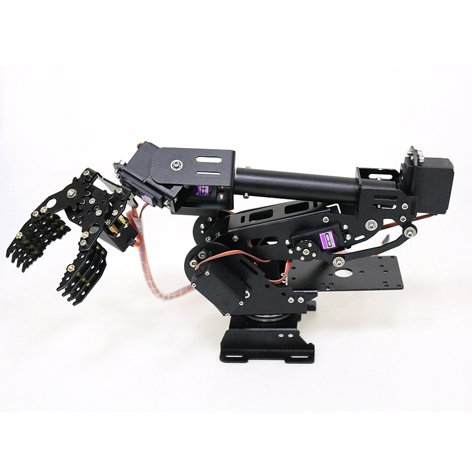
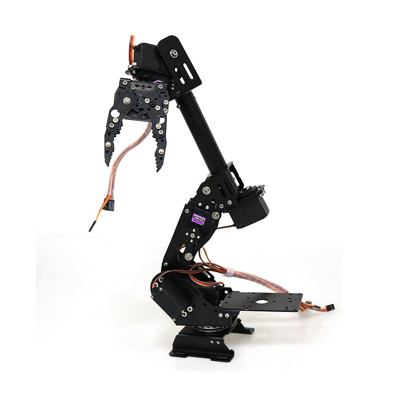
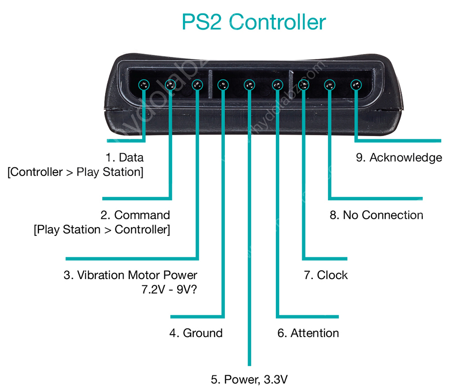
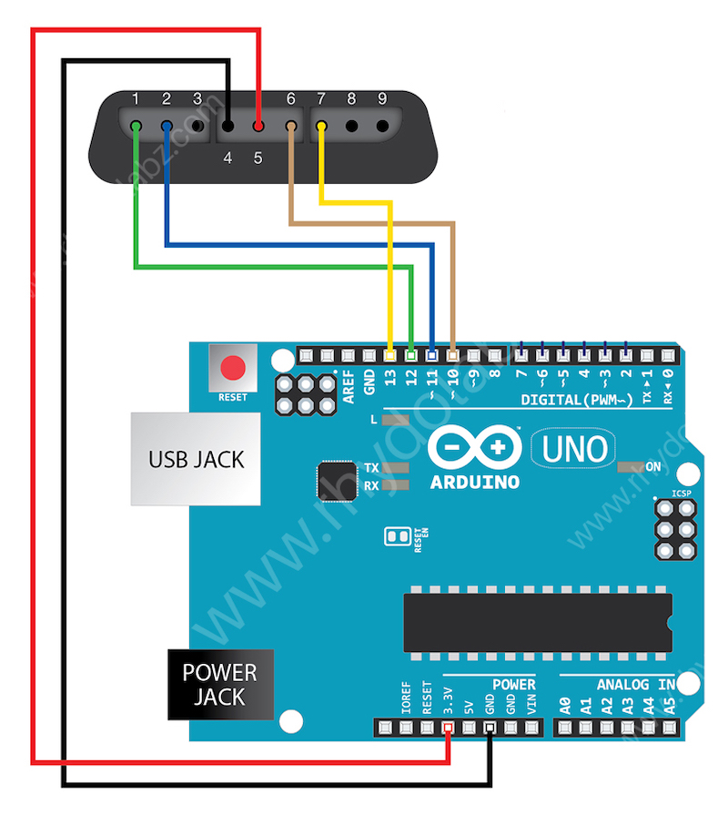

# Tanko

<div align="center">

</div>

This repo include several files to build a robot with a tank chassis and a robotic arm.

## Robot Tank Car Chassis

Robot tank car chassis TS100 with shock suspension from [AliExpress](https://www.aliexpress.com/item/32773168343.html?spm=a2g0s.9042311.0.0.1f7d4c4dAjd3yt).

Manufacturer [documentation](https://github.com/SmartArduino/SZDOITWiKi/wiki/Robot-car-Preface).

Assembly [instructions](ts100/Installation_TS100.pdf).

<div align="center">

</div>

<div align="center">

</div>

## Robot Arm

8 DoF Aluminum Alloy Metal Robot Arm with claw from [AliExpress](https://www.aliexpress.com/item/32778931184.html?spm=a2g0s.9042311.0.0.1f7d4c4dAjd3yt).

Manufacturer [documentation](https://github.com/SmartArduino/SZDOITWiKi/wiki/Robotics-Robot-Arm).

Assembly [instructions](arm/大臂中英文组装说明S8.pdf).

<div align="center">

</div>

<div align="center">

</div>

## Arduino Dev Board

PS2 handle/joystick Control kit for Arduino Robot [AliExpress](https://www.aliexpress.com/item/32820503728.html?spm=a2g0s.9042311.0.0.1f7d4c4dAjd3yt)

Arduino [sample code](arduino) to control 2 dc motors in car chassis using arduino uno and PS2 controller.

### Shield

2 Motor and 16 Servo shield for Arduino from [SmartArduino](http://www.smartarduino.com/view.php?id=94895).

[Manual](shields/2_Motor_and_16_Servo_Shield.pdf).

Manufacturer [documentation](https://github.com/SmartArduino/SZDOITWiKi/wiki/Arduino---2-way%26amp%3B16-way-motor%26amp%3Bservo-shield)

### PS2 Wireless Controller With Arduino

[Interfacing PS2 Wireless Controller With Arduino](http://www.rhydolabz.com/wiki/?p=12663).

[PlayStation 2 Controller Arduino Library v1.0](http://www.billporter.info/2010/06/05/playstation-2-controller-arduino-library-v1-0/).

[Interfacing a PS2 (PlayStation 2) Controller](https://store.curiousinventor.com/guides/PS2).

Library [Source code](https://github.com/madsci1016/Arduino-PS2X).

Sample [code](arduino/Servo_PS2).

<div align="center">

</div>

<div align="center">

</div>

## Raspberry Pi Dev

Run [tanko.py](raspberry/tanko) in a Raspberry Pi with [Raspbian](https://www.raspberrypi.org/downloads/raspbian/).

```
   sudo python tanko.py
```

[tanko.py](raspberry/tanko) allows to control 2 dc motors and 8 servos using the next shields.

Use iOS app to control Raspberry Pi.

### Servo Shield

Servo Motor Driver IIC Module 16 Channel PWM Outputs 12 Bit Resolution I2C Compatible with Raspberry Pi from [Amazon](https://www.amazon.com/dp/B07H9ZTWNC/ref=cm_sw_em_r_mt_dp_U_Q3XVEbS2S8GW1).

Manufacturer [documentation](shields/Servo_Driver_HAT_User_Manual_EN.pdf).

Manufacturer [page](https://www.waveshare.com/wiki/Servo_Driver_HAT).

### DC Motors Shield

DC Motor driver shield for Raspberry Pi from [Amazon](https://www.amazon.com/dp/B01MQ2MZDV/ref=cm_sw_em_r_mt_dp_U_f2XVEbNSN6X2Z).

Manufacturer [documentation](shields/DC_motor_shield).

Manufacturer [page](https://github.com/sbcshop/MotorShield).

## iOS App

The [iOs app](iOS) controls a raspberry pi with [Raspbian](https://www.raspberrypi.org/downloads/raspbian/) and running [tanko.py](raspberry/tanko/).
